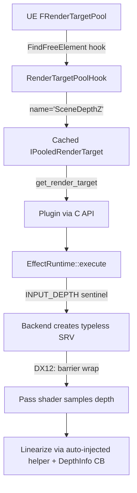

# Research Report: Depth Buffer Support & Glamarye Fast Effects Port Feasibility

**Date Compiled:** [2026-05-22] (original), revised [2026-05-22] after reading
the upstream Glamarye repo end-to-end and re-auditing UEVR's existing
depth-acquisition path.
**Status:** [PROPOSED] — implementation not started.
**Topic:** Adding generic depth-buffer support to the `uevr::fx::EffectRuntime`
post-processing pipeline, and porting *Glamarye Fast Effects for ReShade*
(FXAA + Sharpen + Fast AO + DOF + Fake GI + adaptive contrast) on top of it.

---

## 1. Executive Summary (revised)

**Feasibility: HIGH** for the FXAA / Sharpen / Fast-AO / DOF / Detect-Menus /
Detect-Sky subset of Glamarye. **MEDIUM** for Fake GI (additional blur passes
+ tone-mapping inversion). The risks the earlier draft of this document
listed (stereo RT-manager hooking, normal-buffer capture, projection-matrix
synchronization, jitter shimmer) are either **already solved in UEVR** or
**not actually required by Glamarye's algorithms**.

Key facts from this round of research:

1. UEVR **already captures `SceneDepthZ`** via a name-keyed
   `FRenderTargetPool::FindFreeElement` hook
   ([src/mods/vr/RenderTargetPoolHook.cpp](../../src/mods/vr/RenderTargetPoolHook.cpp))
   and ships a plugin-facing C API
   (`RenderTargetPoolHook::activate()` + `get_render_target(L"SceneDepthZ")`)
   in [include/uevr/API.hpp](../../include/uevr/API.hpp#L1663-L1680). The
   originally proposed `IStereoRenderTargetManager::AllocateDepthTexture` hook
   is unnecessary.

2. Glamarye is **MIT-licensed** (verified at
   `github.com/rj200/Glamarye_Fast_Effects_for_ReShade/blob/main/LICENSE`,
   Copyright 2021 Robert Jessop (main shader) + Alex Tuderan (blur
   functions)). Direct port permitted with copyright + license preservation.

3. Glamarye's **AO algorithm does not use normals**. It samples 2–16
   equally-spaced depth points on a circle around each pixel and applies a
   "at least half must be closer" rule. No normal reconstruction, no inverse
   projection, no view-space sample positioning. This is the entire reason
   Glamarye is portable across DX9/10/11/12 ReShade.

4. Glamarye's per-pixel math is **screen-space only** for AO/DOF/Sharpen/FXAA.
   It needs a linearized depth value but does **not** need a per-eye inverse
   projection matrix. The TAA/jitter shimmer concern raised earlier does not
   apply to these passes.

5. UEVR's `EffectRuntime` already supports multi-pass effects with
   intermediate RTs, mip-chain generation, per-eye cadence
   (`Cadence::OncePerFrame` for shared history), and HDR colorspace
   classification (`SceneRTColorSpace`). The Glamarye Fake GI two-blur-pass
   topology fits without architectural changes.

**What is genuinely needed:**

- `INPUT_DEPTH = -2` sentinel in `EffectRuntime` with per-API SRV creation
  (typeless reinterpret for `R24G8_TYPELESS` / `R32_TYPELESS` /
  `D24_UNORM_S8_UINT` / `D32_FLOAT`).
- DX12 resource-barrier wrapping
  (`DEPTH_WRITE → DEPTH_READ|PIXEL_SHADER_RESOURCE → DEPTH_WRITE`).
- A small `DepthInfo` cbuffer the runtime auto-populates with
  `{near, far, is_reversed_z, is_perspective}` so ported shaders can call a
  Glamarye-equivalent `LinearizeDepth(z)`.
- A small auto-injected HLSL preamble providing `fx_sample_depth_linear(uv)`.

**What we explicitly will NOT pursue** (out of scope):

- Normal-buffer (GBufferA) capture. Not needed for Glamarye. Could be
  revisited later for real SSAO/SSR ports.
- Per-eye jittered projection matrices.
- Stereo RT-manager hook (obsoleted by the existing RT-pool name hook).

---

## 2. Glamarye Fast Effects — what it actually does

Source of truth: upstream `rj200/Glamarye_Fast_Effects_for_ReShade` v6.4.2,
README + LICENSE. Author Robert Jessop, MIT license.

### 2.1 Effect inventory

| # | Effect | Needs depth? | Needs normals? | Extra passes? |
|---|---|---|---|---|
| 1 | Fast FXAA | No | No | No (single pass) |
| 2 | Intelligent Sharpen | No | No | No (fused with FXAA) |
| 3 | Fast Ambient Occlusion | **Yes** | No (circle samples, not normal-aware) | No |
| 4 | Depth of Field (subtle) | **Yes** | No | No |
| 5 | Detect Menus & Videos | **Yes** (`depth == 0` fast-skip) | No | No |
| 6 | Detect Sky | **Yes** (`depth == 1` fast-skip) | No | No |
| 7 | Fake Global Illumination | Optional (works 2D, better with depth) | No | **Yes** (2 blur levels + 2.5-MIP read) |
| 8 | Adaptive Contrast Enhancement | No | No | Reads blurred RT from (7) |

Per upstream "Tech details": effects 1–4 are fused into ONE pass that reads
each pixel only once (this is the whole point of Glamarye — memory bandwidth
is the bottleneck, not ALU). Fake GI adds 2 extra blur passes.

### 2.2 Why the AO algorithm is so portable

From upstream README "Tech details", Fast AO:

1. Picks N (2–16, default 6) sample points equally spaced on a screen-space
   circle around the pixel.
2. Samples depth at each, compares to center depth.
3. "At least half samples must be closer" → flat surfaces don't shade.
4. Discards extreme outliers; uses adjacent-sample variance as fuzziness for
   smoother shading.
5. Checkerboard dithering: alternate pixels use a half-radius circle so two
   adjacent pixels combined see double the effective sample count.

Step 1 operates in **screen-space pixels**, not view-space. No normal
reconstruction, no inverse projection, no world-space sample positioning. For
UEVR this collapses to: bind depth SRV, supply `LinearizeDepth(z)` via cbuffer
+ helper, and the AO pass works.

### 2.3 What "depth working" requires upstream

From README "Setup step 6" + "Troubleshooting → Depth buffer issues":

- Linearized depth where close = 0.0, far = 1.0.
- Per-pixel alignment with color (otherwise visible AO halos around objects).
- Available continuously during gameplay (otherwise menus get processed).

ReShade provides this via `ReShade.fxh::GetLinearizedDepth` plus
pre-processor knobs (`RESHADE_DEPTH_INPUT_IS_REVERSED`,
`RESHADE_DEPTH_INPUT_IS_LOGARITHMIC`, `RESHADE_DEPTH_LINEARIZATION_FAR_PLANE`,
etc.). UEVR will inject the equivalent at runtime from known engine state:
UE4/5 stock is reversed-Z, perspective, FP24/FP32 depth.

### 2.4 Source code availability

Upstream HLSL is at `Shaders/Glamarye_Fast_Effects.fx` in the repo. (Raw GitHub
URL 404'd during the fetch this session — the README + repo browser tree
confirm the file exists; will read directly from the repo when porting.)

---

## 3. Skyrim VR Depth Helper — why the analogy doesn't fully apply

Nexus page `skyrimspecialedition/mods/61434` (blocked from automated scraping
this session; this section reflects what was already known + the Glamarye
README's references). The helper is an SKSE plugin that exposes Skyrim's
static D3D11 depth texture to a **VR-patched ReShade** build, because:

1. Skyrim VR's depth target is engine-internal; stock ReShade's depth
   heuristics can't find it.
2. Stock ReShade has no per-eye awareness; Skyrim's VR-patched ReShade fork
   does, and the helper hands it the right resource handle.

For UEVR the parallel does NOT hold:

- We are **not** running ReShade. We have our own
  `uevr::fx::EffectRuntime` inside UEVR's existing per-eye dispatch.
- We **already have** the depth handle (`SceneDepthZ`) via the RT-pool hook
  for every supported UE4/5 version.
- We **already** handle per-eye dispatch in EffectRuntime — see
  `Cadence::OncePerFrame` and the dispatch-in-frame counter in
  [effect_runtime.hpp](../../examples/renderlib/effects/effect_runtime.hpp#L52-L66).

The Skyrim VR Depth Helper is an **upstream-side workaround for a stock
ReShade limitation**, not a model we need to replicate. The single lesson to
take from it is narrower: a stable per-eye depth handle is useful for both
shaders and depth-layer submission, and UEVR already proves this with its
existing OpenXR depth-layer copies in
[src/mods/vr/D3D12Component.cpp](../../src/mods/vr/D3D12Component.cpp#L532-L582)
and
[src/mods/vr/D3D11Component.cpp](../../src/mods/vr/D3D11Component.cpp#L505-L555).

---

## 4. Architecture (revised)



### 4.1 Step 1 — Depth acquisition (ALREADY DONE)

No new hook needed. `RenderTargetPoolHook::activate()` is already exposed.
Plugin calls it from `on_initialize()`, then per-frame fetches:

```cpp
auto prt = uevr::API::RenderTargetPoolHook::get_render_target(L"SceneDepthZ");
```

**Caveat — known-broken games.** Comment at
[RenderTargetPoolHook.cpp:75](../../src/mods/vr/RenderTargetPoolHook.cpp#L75)
says *"on some games it will crash if we mess with anything"*. Depth-based
plugins inherit this compatibility envelope; they cannot ship
enabled-by-default any broader than UEVR's existing depth-submission feature.

### 4.2 Step 2 — EffectRuntime depth binding (TODO)

**File:** [examples/renderlib/effects/effect_runtime.hpp](../../examples/renderlib/effects/effect_runtime.hpp)

- Add `inline constexpr int INPUT_DEPTH = -2;` next to `INPUT_SCENE`.
- Document depth as read-only, per-eye, automatically linearized via injected
  helper.

**File:** [examples/renderlib/effects/effect_runtime_d3d11.cpp](../../examples/renderlib/effects/effect_runtime_d3d11.cpp)

- On pass execution, if `inputs` contains `INPUT_DEPTH`:
  - Fetch `SceneDepthZ` via plugin API (lazy, cached for the frame).
  - Query desc; pick `DXGI_FORMAT_R24_UNORM_X8_TYPELESS` (D24S8 case) or
    `DXGI_FORMAT_R32_FLOAT` (D32 case). Cache SRV keyed by
    `(resource, format)`.
  - Bind as additional SRV slot.

**File:** [examples/renderlib/effects/effect_runtime_d3d12.cpp](../../examples/renderlib/effects/effect_runtime_d3d12.cpp)

- Same SRV reinterpret rules.
- Wrap pass dispatch with `ResourceBarrier`:
  `DEPTH_WRITE → DEPTH_READ|PIXEL_SHADER_RESOURCE → DEPTH_WRITE`.
  Reference: existing barrier usage in D3D12Component for OpenXR depth
  copies.
- Descriptor heap must be sized to include the depth SRV per pass.

### 4.3 Step 3 — Depth helper injection (TODO)

Runtime auto-injects an HLSL preamble for any pass that binds `INPUT_DEPTH`:

```hlsl
cbuffer fx_depth_info : register(b1) {
    float fx_z_near;
    float fx_z_far;
    uint  fx_reversed_z;   // 1 for stock UE4/5
    uint  fx_perspective;  // 1 normally, 0 for ortho
};

Texture2D    fx_depth_tex : register(t<SLOT>);
SamplerState fx_depth_smp : register(s<SLOT>);

float fx_linearize_depth(float z) {
    float z01 = fx_reversed_z ? (1.0 - z) : z;
    if (!fx_perspective) return lerp(fx_z_near, fx_z_far, z01);
    return (fx_z_near * fx_z_far) / (fx_z_far - z01 * (fx_z_far - fx_z_near));
}

float fx_sample_depth_linear(float2 uv) {
    return fx_linearize_depth(fx_depth_tex.SampleLevel(fx_depth_smp, uv, 0).r);
}
```

`fx_z_near` / `fx_z_far` come from the active per-eye projection matrix
(extractable via `API::VR::get_ue_projection_matrix(eye)` already exposed —
see [include/uevr/API.h:653](../../include/uevr/API.h#L653)). Reversed-Z is
true for stock UE4/5; treat as constant for the first cut and expose an
override only if a game proves it false.

### 4.4 Step 4 — Per-eye routing (ALREADY HANDLED)

`SceneDepthZ` follows the same eye layout as the color scene RT in every
UEVR stereo mode (this is exactly what the existing OpenXR depth-copy code
relies on). EffectRuntime's existing per-dispatch handling routes color
correctly; depth lands at the same coordinates by construction. **No new
eye-routing logic needed.**

---

## 5. Glamarye porting plan

### 5.1 Phasing

| Phase | Deliverable | Risk | Depth needed? |
|---|---|---|---|
| P0 | `INPUT_DEPTH` sentinel + DX11/DX12 SRV plumbing + helper preamble + `depth_debug_plugin` validator | Medium (DX12 barriers + format reinterpret) | n/a (infra) |
| P1 | `glamarye_ao_plugin` — Fast AO only, single pass, opt-in | Low | Yes |
| P2 | `glamarye_dof_plugin` — Subtle DOF on top of P1 plumbing | Low | Yes |
| P3 | Unify into `glamarye_plugin` — FXAA + Sharpen + AO + DOF fused single pass (faithful to upstream's 1-pass design) | Low | Yes |
| P4 | Fake GI variant — 2 blur passes + GI math + adaptive contrast | Medium (mip+blur graph, tone-map inverse) | Optional |

P0–P3 produce a usable AO/DOF/FXAA/Sharpen suite. P4 is a stretch goal.

### 5.2 Faithful-port checklist

Per upstream README "Tech details":

- [ ] FXAA edge detection: diamond sample pattern, 4 diagonals + 2 axial reads.
- [ ] Sharpen: 4-diagonal middle-two-minus-outliers trick, Reinhard-like
      curve clamp.
- [ ] AO: `FAST_AO_POINTS` preprocessor (default 6, range 2–16), circle
      sampling, variance fuzz, checkerboard dither, optional 8-pixel
      `bigger_dither`.
- [ ] AO Shine (negative-AO brightens convex shapes).
- [ ] DOF: depth-blended 5-sample smoothing, 50% max blend cap.
- [ ] Detect menus / detect sky (`depth == 0` / `depth == 1` fast-skip).
- [ ] HDR: PQ / sRGB / scRGB auto-select via `SceneRTColorSpace` — map
      upstream `BUFFER_COLOR_SPACE` to UEVR-side enum.
- [ ] Tone-mapping compensation (Reinhard-inverse for Fake GI in SDR).
- [ ] All upstream user-facing sliders preserved in UEVR config UI for parity.

### 5.3 Things we will NOT change from upstream

- AO sample circle layout (upstream specifically rejected random/rotated
  patterns for cache + dither reasons — don't "improve" it).
- The fused single-pass FXAA+Sharpen+AO+DOF design. Splitting them defeats
  the whole point of Glamarye and would more than double the GPU cost (most
  of the cost is texture reads, not ALU; the design exists to share reads).
- Pre-processor knob names (`FAST_AO_POINTS`, `HDR_WHITELEVEL`). Keep
  identical so upstream presets and community knowledge transfer directly.

---

## 6. Risks (revised)

### Real, must-mitigate

1. **Depth format reinterpret.** If `SceneDepthZ` ever arrives in a format
   outside the expected allow-list
   `{R24G8_TYPELESS, R32_TYPELESS, D24_UNORM_S8_UINT, D32_FLOAT}`, the SRV
   produces silent garbage. Mitigation: explicit allow-list check, log + skip
   on unknown format, never default-bind.
2. **Known broken-depth games.** Pre-existing compatibility envelope; depth
   plugins must respect `is_depth_enabled()` gating.
3. **MIT header preservation.** When porting Glamarye HLSL into a plugin, keep
   the upstream copyright comment block (Robert Jessop / Alex Tuderan) intact
   at the top of the embedded shader string. Per
   [.github/instructions/uevr-clean-code.instructions.md](../../.github/instructions/uevr-clean-code.instructions.md)
   the **plugin C++ source file** still inherits the UEVR-build repo LICENSE
   with no author attribution added; only the embedded HLSL retains the MIT
   block, which is required to satisfy the upstream license.
4. **DX12 state-tracking interference.** Wrapping barriers around an engine
   resource not normally read by our pipeline could TDR if the engine assumed
   exclusive ownership for that frame. Mitigation: reuse the same barrier
   pattern UEVR already uses for OpenXR depth copies (proven path). Validate
   with PIX before shipping.

### Smaller / known-bounded

5. Cinematic DOF + AO interaction — upstream documents this as a
   `cinematic_dof_safe_mode` option; port the option, don't reinvent.
6. Smoke / fog haloing — inherent to all screen-space AO; upstream provides
   `AO max distance` slider — port it.

### Originally listed but DOWNGRADED / REMOVED

- ~~Hooking `IStereoRenderTargetManager::AllocateDepthTexture`~~ → obsolete
  (UEVR uses RT-pool name hook).
- ~~Texture2DArray vs Texture2D eye-routing complexity~~ → color and depth
  share layout; existing color path handles it.
- ~~Per-eye dynamic projection matrix sync for accurate linearization~~ →
  not needed for Glamarye's screen-space algorithms; a static near/far
  cbuffer is sufficient.
- ~~Sub-pixel jitter shimmer~~ → irrelevant for AO/Sharpen/DOF/FXAA. Could
  affect Fake GI's `ddx/ddy` slope estimate but only as quality, not crash.

---

## 7. Effort estimate

No calendar attached; relative weighting:

- **P0** (infrastructure): meaningful EffectRuntime work, DX12-heavy.
  Dominant cost of the whole project.
- **P1** (AO-only plugin): small once P0 lands — single shader file, one
  cbuffer, one pass.
- **P2 / P3** (DOF + fused single-pass): incremental; mostly shader-side
  translation from upstream HLSL.
- **P4** (Fake GI): larger — multi-pass graph + blur RTs + tone-mapping
  compensation.

P0 is shared infrastructure usable by **any** future depth-aware plugin, not
just Glamarye, which is why it is worth doing on its own.

---

## 8. Recommended next action

If we proceed:

1. Land **P0** as its own commit/PR — `INPUT_DEPTH` sentinel + DX11/DX12
   backends + `DepthInfo` cbuffer + helper preamble. Ship a minimal
   `depth_debug_plugin` that visualizes linearized depth, to validate the
   plumbing on the existing `is_depth_enabled()`-compatible games.
2. Iterate Glamarye **P1 → P3** only once P0 is verified on at least two
   such games.
3. Defer Fake GI (**P4**) until P1–P3 are shipping and stable.

If we do not proceed: this document stays as `[PROPOSED]` reference. The same
EffectRuntime-side patterns (sentinel id, barrier wrapping, helper
preamble) will repeat for any future GBuffer-normal or velocity-buffer work.
